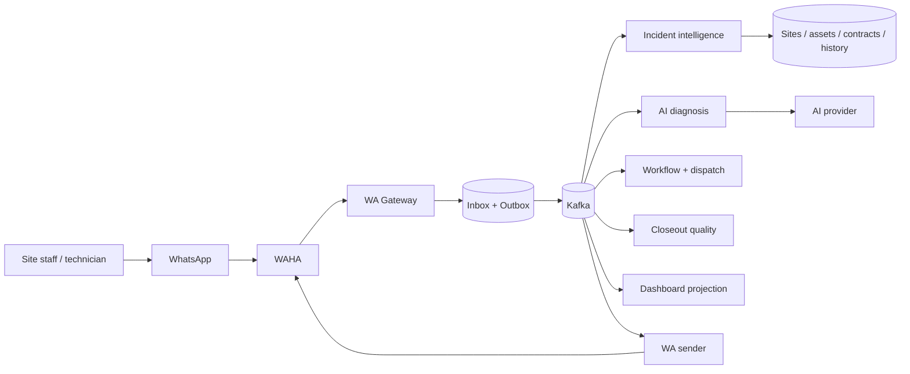

# FieldOps WA

FieldOps WA adalah project belajar manual untuk membangun **AI operations desk berbasis WhatsApp** bagi perusahaan maintenance multi-site.

Sistem menerima laporan teks, foto, voice note, dokumen, atau lokasi melalui WAHA; menghubungkannya dengan site, aset, incident lain, histori perbaikan, kontrak, dan SLA; membantu diagnosis serta dispatch; kemudian menjaga pekerjaan sampai closeout dan repair record lengkap. Kafka menjadi backbone wajib untuk seluruh lifecycle setelah webhook intake.

> Status saat ini: **blueprint v0.4.0**. Source code aplikasi belum diimplementasikan dan `docker-compose.yaml` belum runnable.

## Masalah yang diselesaikan

Targetnya bukan satu kantor yang hanya menerima beberapa laporan barang rusak. Untuk skala tersebut, form dan dispatcher manual sudah cukup.

FieldOps WA mensimulasikan perusahaan facility-management atau maintenance outsourcing yang menangani:

- banyak site milik klien;
- ratusan atau ribuan aset;
- teknisi internal dan vendor spesialis;
- kontrak serta SLA berbeda;
- laporan operasional yang tersebar di WhatsApp;
- histori perbaikan dan manual yang sulit ditemukan saat incident terjadi.

Contoh laporan:

> “Mesin antrean yang dekat CS mati lagi setelah listrik sempat turun. Nomor tidak keluar dan nasabah mulai menumpuk. Yang kemarin sepertinya mesin sebelah. Ini fotonya.”

Sistem tidak cukup hanya mengubah pesan itu menjadi ticket. Sistem harus membantu menjawab:

- site dan aset mana yang dimaksud;
- apakah laporan lain merupakan incident yang sama;
- apa kemungkinan akar masalah berdasarkan foto, manual, dan histori;
- informasi apa yang masih kurang;
- kontrak, vendor, skill, spare part, priority, dan SLA mana yang relevan;
- apakah laporan penyelesaian teknisi sudah lengkap.

## Empat kemampuan inti

1. **Incident intelligence**  
   Resolve site/aset dari bahasa ambigu, mencari duplicate candidate, dan menilai dampak operasional.

2. **Asset-aware diagnosis**  
   Menggunakan message history, media insight, manual, repair history, dependency, contract, dan SLA untuk membuat diagnosis hypothesis yang memiliki evidence.

3. **Dispatch assistance**  
   Merekomendasikan priority, skill, vendor, dan spare part. Dispatcher tetap menyetujui keputusan final.

4. **Closeout quality**  
   Mengubah voice note dan foto teknisi menjadi repair record, lalu meminta root cause, action, validation, serial number, atau evidence yang masih kurang.

## Arsitektur ringkas



Jalur webhook hanya memvalidasi, menormalisasi, melakukan deduplication, dan menulis inbox + outbox. AI dan business workflow tidak berjalan di request path.

Jika Kafka tidak tersedia, pesan tetap tersimpan di outbox tetapi incident berhenti diproses sampai backbone pulih. Tidak ada fallback workflow in-process.

## Struktur repository

Seluruh source code wajib berada di bawah [`apps/`](apps/).

```text
fieldops-wa/
├── apps/
│   ├── backend/                  # API dan seluruh process runtime
│   │   ├── src/
│   │   │   ├── api/
│   │   │   ├── processes/
│   │   │   │   ├── wa-gateway/
│   │   │   │   ├── outbox-relay/
│   │   │   │   ├── enrichment/
│   │   │   │   ├── ai-ops/
│   │   │   │   ├── workflow/
│   │   │   │   ├── wa-sender/
│   │   │   │   └── projection/
│   │   │   └── bootstrap/
│   │   └── tests/
│   ├── core/                     # Domain dan shared library
│   │   ├── src/
│   │   │   ├── domain/
│   │   │   ├── contracts/
│   │   │   ├── database/
│   │   │   ├── services/
│   │   │   ├── knowledge/
│   │   │   └── observability/
│   │   ├── fixtures/
│   │   └── tests/
│   └── frontend/                 # Dispatcher dan learning-lab UI
│       ├── src/
│       └── tests/
├── docs/
│   ├── FIELDOPS_WA_BLUEPRINT.html
│   └── plans/
├── docker-compose.yaml           # Infrastruktur lokal, belum diisi
└── README.md
```

### Aturan ownership

| Folder | Memiliki | Tidak boleh |
|---|---|---|
| `apps/backend` | HTTP API, process entrypoints, Kafka consumers/producers, WA gateway/sender, workers | Mendefinisikan ulang domain atau event schema milik core |
| `apps/core` | Domain rules, contracts, persistence, migrations, adapters, knowledge retrieval, fixtures | Membuka port atau menjadi long-running process |
| `apps/frontend` | Dispatcher board, evidence review, approval, lag, AI runs, DLQ, learning lab | Mengakses Kafka, database, WAHA, atau AI provider secara langsung |
| Root | Compose, docs, repository metadata, thin orchestration | Menyimpan business logic, migration, fixture, atau source code aplikasi |

Jika code digunakan bersama, code tersebut masuk `apps/core`; jangan membuat sibling `packages/`, `workers/`, atau `scripts/` di root.

## Stack yang dikunci

| Area | Keputusan |
|---|---|
| Runtime | Node.js `v24.13.1` |
| Backend | JavaScript, Express, CommonJS, entry point `server.js` |
| Core | JavaScript, frameworkless, CommonJS, entry point `index.js` |
| Frontend | JavaScript, React + Vite, ESM bawaan Vite |
| Package manager | npm dengan `package-lock.json` per app |
| Dependency internal | `apps/backend` memakai `"core": "file:../core"` |
| Kafka client | KafkaJS |
| Development command | `node --env-file=.env --watch server.js` untuk backend; pola setara untuk process entrypoint lain |
| Test runner | Built-in `node:test` |

Pilihan stack sudah dikunci, tetapi S0-01 belum selesai sampai producer/consumer KafkaJS dibuktikan dapat connect, melakukan manual offset commit, menangani error, dan shutdown dengan bersih pada Node.js `v24.13.1`.

## Mengapa Kafka wajib

Satu incident dapat memicu beberapa pekerjaan independen:

- media extraction dan transcription;
- site/asset candidate resolution;
- duplicate detection;
- knowledge retrieval dan AI diagnosis;
- SLA calculation;
- dashboard projection;
- notification;
- audit;
- asset-history update setelah closeout.

Project harus membuktikan partitioning, consumer groups, offset commit, at-least-once delivery, idempotency, retry, DLQ, rebalance, transactional outbox, fan-out, dan replay. Jika workflow masih dapat berjalan normal tanpa Kafka, desain dianggap gagal memenuhi tujuan belajar.

## Peran AI

AI menghasilkan candidate dan recommendation, bukan keputusan final. Setiap diagnosis harus memiliki evidence reference ke message, media insight, manual, repair history, atau contract rule.

AI tidak boleh:

- membuat site atau asset identifier;
- melakukan merge incident secara otomatis;
- menetapkan dispatch final;
- mengirim WhatsApp secara langsung;
- menutup work order tanpa approval;
- menjalankan instruksi yang ditemukan di pesan customer.

## Skenario demo akhir

Demo MVP menggunakan vendor maintenance cabang bank dengan data sintetis:

1. Staf cabang melaporkan mesin antrean mati setelah voltage drop.
2. Laporan kedua mengenai printer nomor muncul dari site yang sama.
3. Sistem mengusulkan keduanya sebagai satu incident.
4. Sender mapping, foto, registry, dan histori menghasilkan kandidat site, mesin antrean, dan UPS.
5. Manual serta repair history dipakai untuk diagnosis awal.
6. Sistem meminta foto indikator UPS yang masih kurang.
7. Dispatcher menyetujui merge, priority, dan assignment.
8. Teknisi memperbarui pekerjaan melalui WhatsApp.
9. AI mendeteksi serial number pengganti belum tercatat dan meminta kelengkapan.
10. Closeout yang disetujui menambah repair record pada asset history.
11. Duplicate event tidak menggandakan work order atau pesan keluar.
12. Projection dapat dihapus dan dibangun kembali melalui Kafka replay.

## Tujuan belajar

- Membuat adapter WAHA dan memahami webhook, session, media, reply context, serta outbound uncertainty.
- Memanggil AI dengan structured output, schema validation, timeout, retry, provenance, dan eval.
- Mengelola prompt injection sebagai untrusted data, bukan instruction.
- Memahami Kafka melalui kegagalan nyata, bukan sekadar producer/consumer happy path.
- Menulis state machine, idempotency, transactional outbox, retry/DLQ, dan replay secara manual.
- Membandingkan AI dengan baseline deterministik agar kompleksitas model memiliki bukti manfaat.

## Kontrak coding manual

- Implementasi pertama ditulis manual dan tidak disalin dari project lama.
- AI boleh menjelaskan konsep, memberi hint bertingkat, dan me-review diff.
- AI tidak menghasilkan module, migration, test suite, atau event contract utuh sebelum versi manual tersedia.
- Status task hanya berubah setelah command/test/skenario benar-benar dijalankan dan buktinya dicatat.

## Status

| Area | Status |
|---|---|
| Product dan architecture blueprint | Selesai, v0.4.0 |
| Folder boundaries | Dikunci |
| Sprint delivery plan | Usulan, 12 sprint (21 Sep–13 Des 2026) |
| Backend | Belum dimulai |
| Core | Belum dimulai |
| Frontend | Belum dimulai |
| Local infrastructure | Belum dikonfigurasi |
| End-to-end demo | Belum tersedia |

## Dokumentasi

- [Blueprint kanonik](docs/FIELDOPS_WA_BLUEPRINT.html)
- [Implementation plan](docs/plans/PLAN_FIELDOPS_WA_BLUEPRINT.md)
- [Sprint delivery plan](docs/plans/PLAN_SPRINT_DELIVERY.md)

Blueprint adalah sumber kebenaran untuk kontrak produk, arsitektur, decision ledger, open items, delivery board, dan version history.

## Open decisions dan verifikasi sebelum implementasi

- Verifikasi Node.js `v24.13.1` + KafkaJS melalui spike S0-01.
- AI provider/model serta transcription strategy.
- WAHA edition/version dan media contract.
- Kafka distribution lokal dan partition count.
- Retention raw payload, media, AI response, topic, dan DLQ.
- Grammar command teknisi.
- Asset/contract model minimum.
- Knowledge retrieval baseline: deterministic keyword/filter atau vector search.

Belum ada perintah instalasi atau menjalankan aplikasi karena source code dan local infrastructure belum dibuat. README ini harus diperbarui dalam perubahan yang sama saat P0 menghasilkan command yang benar-benar dapat dijalankan.
