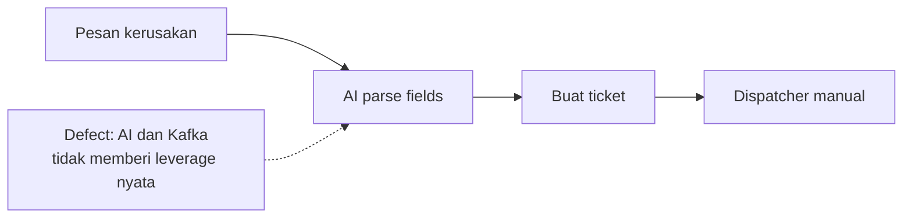
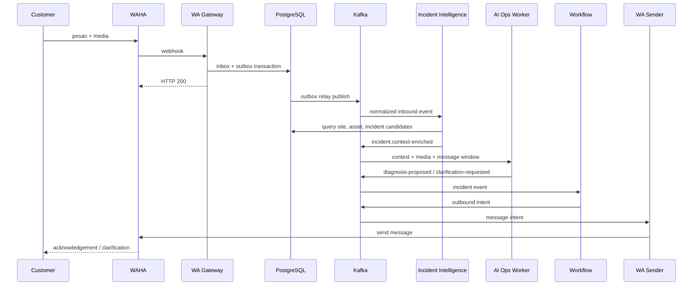

# FieldOps WA — Implementation Plan


> **21 September 2026:** Scope awal “laporan kerusakan → work order” dinilai tidak cukup membenarkan AI atau Kafka. FieldOps WA dipivot menjadi AI operations desk untuk perusahaan maintenance multi-site.

[TOC]

> [!IMPORTANT]
> Spesifikasi kanonik berada di [`../FIELDOPS_WA_BLUEPRINT.html`](../FIELDOPS_WA_BLUEPRINT.html). Dokumen ini hanya indeks eksekusi agar keputusan produk dan arsitektur tidak digandakan di dua tempat.

---

## Masalah

Scope awal hanya menerima laporan maintenance, mengekstrak field, lalu membuat work order. Untuk perusahaan kecil, pekerjaan tersebut lebih efisien diselesaikan dengan form, database, dan dispatcher manual. AI hanya menjadi parser mahal dan Kafka menjadi queue tempelan.



Scope baru menargetkan perusahaan facility-management atau maintenance outsourcing yang menangani banyak site, aset, teknisi, vendor, kontrak, dan SLA. Masalahnya bukan memasukkan ticket, tetapi menghubungkan laporan ambigu dengan konteks operasional dan menjaga pengetahuan sampai closeout.

| Kebutuhan belajar | Bukti akhir |
|---|---|
| WAHA | Pesan teks, gambar, audio, reply context, dan outbound delivery berjalan melalui adapter |
| AI | Site/asset resolution, duplicate proposal, evidence-backed diagnosis, clarification, dispatch recommendation, closeout extraction, provenance, dan eval |
| Kafka | Lifecycle incident/work order/asset history, ordering, groups, offset, retry, DLQ, rebalance, idempotency, outbox, fan-out, dan replay dibuktikan |
| Output industri | Incident terhubung ke site/aset/SLA, dispatch tepat, repair record lengkap, dan asset history bertambah |

---

## Keputusan scope

- Target: operator maintenance multi-site, bukan satu kantor atau ticketing umum.
- Vertikal demo sintetis: vendor maintenance cabang bank—AC, listrik/UPS, mesin antrean, dan jaringan.
- Dataset MVP: 10 site, 100 aset, teknisi/vendor, contracts/SLA, parts, manuals, repair history, dan 50 skenario berlabel.
- Seluruh source code berada di `apps/backend`, `apps/core`, atau `apps/frontend`; root hanya orchestration/config, docs, dan metadata.
- Satu monorepo dengan beberapa process di dalam `apps/backend`; bukan microservice multi-repository.
- Kafka wajib untuk seluruh business processing setelah webhook intake.
- AI mengusulkan entity match, duplicate merge, diagnosis, dispatch, dan closeout structure; dispatcher menyetujui keputusan material.
- PostgreSQL menyimpan command state, inbox/outbox, dan projections.
- Binary media disimpan di object storage, bukan Kafka.
- Multi-tenant production, billing, mobile app, ERP, dan autonomous dispatch berada di luar MVP.

> [!NOTE]
> Konsekuensi yang diterima: dataset industri bersifat sintetis sehingga business value belum tervalidasi customer nyata; environment satu broker tidak membuktikan high availability; satu PostgreSQL masih shared dependency; outbound WhatsApp tidak dapat dijanjikan exactly-once tanpa contract idempotency dari transport.

---

## Desain

**Request path hanya mendurabilkan pesan; Kafka menggerakkan incident intelligence, asset-aware diagnosis, dispatch, closeout, SLA, notification, projection, dan asset-history update.**



Alternatif yang ditolak:

| Alternatif | Alasan ditolak |
|---|---|
| Ticket intake saja | Form dan dispatcher manual sudah cukup; AI/Kafka tidak memiliki alasan arsitektural |
| AI di webhook | Menahan response WAHA dan membuat retry vendor menggandakan pekerjaan |
| BullMQ | Tidak mengajarkan partition, groups, offsets, rebalance, dan log replay |
| Kafka untuk audit saja | Sistem tetap dapat bekerja tanpa Kafka sehingga Kafka menjadi tempelan |
| Event sourcing penuh | Menambah kompleksitas aggregate sebelum fundamental Kafka dikuasai |

Parameter awal yang masih harus dibuktikan lewat spike:

- Node.js `v24.13.1`, JavaScript, CommonJS untuk backend/core, npm, dan KafkaJS; pilihan sudah dikunci tetapi producer/consumer belum diverifikasi.
- Kafka distribution lokal dan partition count.
- AI provider/model serta batas token, timeout, dan rate limit.
- WAHA edition/version dan media contract.
- Retention untuk raw payload, media, AI response, topic, dan DLQ.
- Asset/contract schema dan knowledge retrieval baseline.

Struktur source yang dikunci:

```text
apps/
├── backend/   # API + seluruh long-running process dan workers
├── core/      # domain, contracts, database, adapters, knowledge, fixtures
└── frontend/  # dispatcher dan learning-lab UI
```

Tidak ada sibling `packages/`, `workers/`, `scripts/`, atau source-code folder lain di root. Jika code dipakai bersama, ownership-nya tetap `apps/core`.

---

## Yang diubah

### Dokumentasi

- [x] Membuat blueprint kanonik `docs/FIELDOPS_WA_BLUEPRINT.html`.
- [x] Mendefinisikan product contract dan batas MVP.
- [x] Mendefinisikan boundary WAHA, Kafka, AI, workflow, dan projection.
- [x] Mendefinisikan delivery board, decision ledger, open items, dan reliability lab.
- [x] Mem-pivot product contract ke operasi multi-site dan mencatat v0.1.0 sebagai scope yang digantikan.
- [x] Menambahkan incident intelligence, asset-aware diagnosis, dispatch assistance, dan closeout quality.
- [x] Mengunci struktur apps-only dan memperbarui blueprint ke v0.3.0.
- [x] Membuat root `README.md` sebagai pintu masuk project.
- [x] Mengunci stack awal: Node.js `v24.13.1`, JavaScript, Express, core frameworkless, React + Vite, CommonJS backend/core, npm, KafkaJS, dan `node:test`.
- [ ] Menambahkan observed evidence ketika setiap spike atau fase benar-benar dijalankan.

### Implementasi

- [ ] P0 — bootstrap `apps/backend`, `apps/core`, `apps/frontend`, contracts, dan local environment.
- [ ] P1 — WAHA intake dan normalization.
- [ ] P2 — Kafka backbone, outbox, idempotency, retry, dan DLQ.
- [ ] P3 — entity resolution, duplicate detection, retrieval, diagnosis, clarification, provenance, dan eval.
- [ ] P4 — incident workflow, approval, assignment, technician commands, closeout, dan asset history.
- [ ] P5 — dashboard, observability, replay, dan final demo.

---

## Verifikasi

| Skenario | Ekspektasi | Hasil |
|---|---|---|
| Blueprint HTML parse | Tidak ada fatal markup error | ✅ Chrome memuat 18 section; progress script menghasilkan `P0 · 0/4 done` |
| Anchor dan filter | Seluruh target navigasi ada dan filter bekerja | ✅ Tidak ada target hilang; Architecture menampilkan 7 section; reset menampilkan 18 |
| Responsive render | Desktop dan mobile terbaca tanpa overlap | ✅ Diperiksa pada 1440×1200 dan 390×844; mobile tidak memiliki page overflow |
| Apps-only root boundary | Tiga folder apps dan README ada; root tidak membawa source code | ✅ `apps/backend`, `apps/core`, `apps/frontend`, README, docs, dan Compose terdeteksi |
| Infrastructure boot | Kafka, PostgreSQL, dan object storage sehat | Belum diimplementasikan |
| End-to-end demo | Incident intelligence sampai asset-history update dan reliability scenarios lulus | Belum diimplementasikan |

Verifikasi dilakukan dengan Chrome headless dan DevTools Protocol terhadap berkas lokal. Verification record di blueprint diperbarui dalam perubahan yang sama dengan bukti.

---

## Risiko

| Risiko | Dampak | Mitigasi |
|---|---|---|
| AI atau media mengalihkan fokus dari Kafka | Project selesai sebagai chatbot biasa | P2 Kafka backbone selesai sebelum P3 AI dimulai |
| Dataset operasional terlalu dangkal | AI terlihat pintar hanya karena fixture mudah | Sertakan ambiguity, duplicate, dependencies, conflicting evidence, history, contract, dan SLA |
| AI tidak mengalahkan baseline deterministik | Kompleksitas model tidak memberi manfaat | Bandingkan terhadap baseline sender mapping + keyword/filter; hentikan capability yang tidak unggul |
| Abstraction terlalu dini | Fundamental Kafka tersembunyi di helper generik | Tulis producer dan consumer kecil secara eksplisit dahulu |
| Copy code dari project lama | Otot coding manual tidak terlatih | Implementasi pertama tidak menyalin helper Everest/Sentinel/Jessica |
| Side effect ganda | Work order atau pesan keluar terduplikasi | Unique constraints, processed-events ledger, delivery ledger |
| Poison event memblokir partition | Backlog kasus lain tidak bergerak | Bounded retry, classification, DLQ, dan re-drive |
| Data WhatsApp nyata masuk fixture | Kebocoran privasi | Fixture sintetis; masking log; retention ditetapkan sebelum data nyata |

---

## Sisa

- [ ] Verifikasi pilihan O-001 melalui spike KafkaJS pada Node.js `v24.13.1`.
- [ ] Putuskan O-002 AI provider awal.
- [ ] Verifikasi O-003 WAHA edition/version dan event contract.
- [ ] Putuskan O-004 Kafka distribution lokal.
- [ ] Putuskan O-005 retention data.
- [ ] Putuskan O-006 grammar command teknisi.
- [ ] Putuskan O-007 asset dan contract model minimum.
- [ ] Putuskan O-008 knowledge retrieval strategy melalui baseline terukur.
- [ ] Mulai P0 hanya setelah open items yang memengaruhi bootstrap cukup terjawab.
