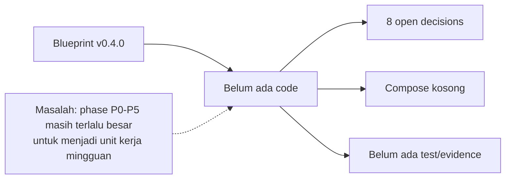
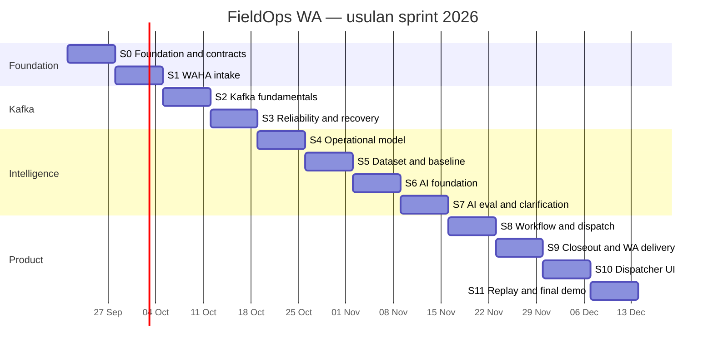
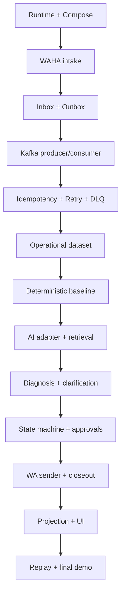

# FieldOps WA — Sprint Delivery Plan

> **21 September 2026:** blueprint v0.4.0 sudah mengunci produk, batas folder, dan stack awal, tetapi belum memiliki backlog implementasi yang cukup kecil untuk dikerjakan dan dibuktikan per minggu. Dokumen ini memecahnya menjadi epic, sprint, dan task.

[TOC]

> [!IMPORTANT]
> [`../FIELDOPS_WA_BLUEPRINT.html`](../FIELDOPS_WA_BLUEPRINT.html) tetap menjadi sumber kebenaran produk dan arsitektur. Dokumen ini mengatur urutan delivery. Jika sprint memaksa perubahan kontrak produk atau arsitektur, ubah blueprint dan decision ledger terlebih dahulu.

---

## Masalah

Kondisi repository saat perencanaan dibuat:

- `apps/backend`, `apps/core`, dan `apps/frontend` sudah ada tetapi masih kosong;
- `README.md` dan blueprint sudah tersedia;
- `docker-compose.yaml` masih kosong;
- belum ada runtime, dependency, test, migration, atau command yang dapat dijalankan;
- delapan open decision masih harus diselesaikan melalui spike, bukan asumsi diam-diam.

| Konsekuensi tanpa sprint breakdown | Dampak |
|---|---|
| Mulai dari UI atau AI karena terlihat menarik | Kafka dan reliability menjadi tempelan |
| Satu phase dianggap satu sprint | Sprint AI/Kafka terlalu besar dan tidak pernah benar-benar selesai |
| Tidak ada demo gate | Code dapat bertambah tanpa membuktikan konsep yang sedang dipelajari |
| Tidak ada task dependency | Workaround sementara berubah menjadi arsitektur permanen |
| Status berdasarkan “sudah ditulis” | Progress terlihat maju meski belum pernah dijalankan |

---

## Keputusan scope

### Bentuk sprint

- Dua belas sprint, masing-masing tujuh hari.
- Tanggal usulan: **21 September–13 Desember 2026**.
- Satu developer, manual coding, dengan kapasitas asumsi **12–18 focused hours per sprint**.
- Estimasi menggunakan story point relatif: `1` kecil, `2` jelas, `3` sedang, `5` perlu eksplorasi, `8` harus dipecah.
- Target kapasitas awal: 17–24 SP per sprint. Velocity aktual menggantikan asumsi setelah Sprint 1.
- Tidak ada task implementasi yang dianggap selesai hanya karena file sudah dibuat.

> [!CAUTION]
> Kapasitas 12–18 jam dan tanggal sprint adalah asumsi perencanaan, bukan observed velocity. Jika waktu nyata berbeda, pertahankan urutan dependency dan geser tanggal; jangan memotong verification gate.

### Alternatif yang dipertimbangkan

| Pendekatan | Kelebihan | Kekurangan | Keputusan |
|---|---|---|---|
| 3 sprint × 2 minggu | Sedikit ceremony | Feedback Kafka dan AI terlalu lambat; scope tiap sprint besar | Ditolak |
| 6 sprint × 1 minggu | Sama dengan P0–P5 blueprint | P2 dan P3 terlalu padat untuk solo manual coding | Ditolak setelah breakdown |
| 8 sprint × 1 minggu | Learning outcome terpisah | Empat sprint akhir masih 28–41 SP setelah estimation | Ditolak setelah estimation |
| **12 sprint × 1 minggu** | Backlog mingguan berada pada 17–24 SP dan tetap punya weekly demo | Horizon kalender lebih panjang | **Dipilih** |
| Tanpa timebox | Fleksibel | Mudah terseret polish, abstraction, dan AI experimentation | Ditolak |

### Batas yang diterima

- Scope demo tetap data sintetis maintenance cabang bank.
- Authentication, authorization production, billing, Kubernetes, dan real ERP/CMMS tidak masuk dua belas sprint.
- UI baru dimulai setelah jalur WAHA → Kafka → incident → work order terbukti headless.
- AI real baru dipakai setelah deterministic baseline dan fake model tersedia.
- Kafka local satu broker cukup untuk belajar semantics, tetapi bukan bukti high availability.

---

## Desain delivery

**Setiap sprint harus berakhir dengan satu perilaku yang dapat didemonstrasikan, satu failure mode yang dipahami, dan evidence yang dapat diulang.**

### Definition of Ready

Task boleh masuk sprint jika:

- outcome-nya dapat diamati;
- dependency dan folder owner diketahui;
- acceptance criteria dapat diuji;
- data/fixture tidak memakai data pribadi nyata;
- task maksimal `5 SP`; task `8 SP` harus dipecah;
- open decision yang mengubah implementasi sudah diputuskan atau task-nya memang spike untuk mengambil keputusan itu.

### Definition of Done

Task selesai hanya jika:

- code berada di folder `apps/*` yang benar;
- happy path dan failure path relevan diuji;
- command verifikasi benar-benar dijalankan;
- observed output dicatat dalam sprint evidence;
- dokumentasi, event fixture, dan migration diperbarui bila terdampak;
- tidak ada secret, nomor WhatsApp, media, atau data customer nyata di Git;
- status delivery board di blueprint diperbarui hanya jika task phase-level benar-benar selesai.

---

## Epic backlog

| Epic | Nama | Outcome | Sprint | Exit gate |
|---|---|---|---|---|
| E-01 | Foundation & contracts | Tiga app dapat di-install/test; infra dasar hidup; kontrak awal terkunci | S0 | Fresh checkout menjalankan quality gate dan dependency health |
| E-02 | WhatsApp transport | Pesan WAHA normal, durable, deduplicated, dan dapat dibalas | S1 | Text + image masuk sekali meski webhook diduplikasi |
| E-03 | Kafka event backbone | Outbox mem-publish; consumer memproses dengan key dan commit yang benar | S2 | Broker outage tidak menghilangkan inbound; recovery mengejar backlog |
| E-04 | Reliability & recovery | Retry, DLQ, idempotency, rebalance, dan observability dibuktikan | S3 | Empat failure experiments awal lulus |
| E-05 | Operational data & baseline | Site, asset, contract, history, manual, dan baseline deterministic tersedia | S4–S5 | Baseline menghasilkan candidate/evidence yang terukur |
| E-06 | AI incident intelligence | AI mengalahkan/menambah baseline pada eval yang ditetapkan | S6–S7 | Entity, duplicate, diagnosis, clarification, dan provenance terukur |
| E-07 | Dispatch & closeout | Incident menjadi work order; teknisi bekerja lewat WA; asset history bertambah | S8–S9 | End-to-end headless sampai approved closeout lulus |
| E-08 | Dispatcher UI & replay | Human approval, observability, replay, dan final demo dapat dijalankan | S10–S11 | Acceptance demo dan eight-experiment evidence pack lulus |
| E-09 | Documentation & evidence | README, blueprint, runbook, ADR, dan evidence tetap sesuai kenyataan | S0–S11 | Tidak ada command/status yang diklaim tanpa observed result |

### Pemetaan blueprint ke sprint

| Blueprint phase / experiment | Sprint owner | Bukti utama |
|---|---|---|
| P0 — Contracts and local environment | S0 | Toolchain, Compose, event contract, migration, dan setup runbook |
| P1 — WAHA intake | S1 | Pesan nyata, normalization, inbox dedup, media, dan outbound spike |
| P2 — Kafka backbone | S2–S3 | Outbox, producer/consumer, offset semantics, retry, DLQ, dan idempotency |
| P3 — Incident intelligence and diagnosis | S4–S7 | Operational data, baseline, AI adapter, clarification, provenance, dan eval |
| P4 — Dispatch and closeout quality | S8–S9 | State machine, approval, assignment, technician commands, dan asset history |
| P5 — Dashboard, replay, and final demo | S10–S11 | Operations UI, projection rebuild, evidence pack, dan acceptance demo |
| L-001–L-004 | S3 | Backlog recovery, duplicate delivery, crash window, dan poison message |
| L-005 | S7 | AI outage |
| L-006 | S9 | WAHA delivery uncertainty |
| L-007–L-008 | S11 | Rebalance dan replay |

---

## Sprint 0 — Foundation and contracts

**Tanggal usulan:** 21–27 September 2026  
**Epic:** E-01, E-09  
**Sprint goal:** Dari repository dokumentasi menjadi monorepo tiga app dengan toolchain, dependency lokal, schema awal, dan quality gate yang benar-benar dapat dijalankan.

### Keputusan awal S0-01

| Area | Pilihan yang dikunci | Status verifikasi |
|---|---|---|
| Runtime | Node.js `v24.13.1` | Belum dijalankan pada project ini |
| Backend | JavaScript + Express + CommonJS; `server.js` | Belum di-bootstrap |
| Core | JavaScript frameworkless + CommonJS; `index.js` | Belum di-bootstrap |
| Frontend | JavaScript + React + Vite; ESM | Belum di-bootstrap |
| Package management | npm; `package-lock.json` per app; backend memakai `"core": "file:../core"` | Belum di-install |
| Kafka client | KafkaJS | Producer/consumer spike belum dijalankan |
| Development | `node --env-file=.env --watch` | Belum dijalankan |
| Test runner | Built-in `node:test` | Belum dijalankan |

> [!CAUTION]
> Pilihan stack sudah diputuskan, tetapi S0-01 tetap berstatus belum selesai sampai KafkaJS connect, manual commit, error path, dan graceful shutdown dibuktikan pada Node.js `v24.13.1`.

### Task

| ID | Task | Folder/output | SP | Dependency | Acceptance criteria |
|---|---|---|---:|---|---|
| S0-01 | Validasi runtime, package manager, module style, dan Kafka client yang sudah dipilih | Evidence di `docs/`; update O-001 | 3 | — | KafkaJS producer/consumer dapat connect, manual commit, menangani error path, dan shutdown bersih pada Node.js `v24.13.1` |
| S0-02 | Bootstrap tiga app dan root orchestration tipis | `apps/backend`, `apps/core`, `apps/frontend` | 3 | S0-01 | Install, lint, test kosong, dan build/typecheck yang dipilih dapat dipanggil dari masing-masing app |
| S0-03 | Isi local infrastructure Compose | `docker-compose.yaml` | 3 | S0-01 | Kafka, PostgreSQL, dan object storage memiliki health check; restart tidak menghapus volume yang disengaja |
| S0-04 | Buat config loader fail-fast dan `.env.example` per app yang membutuhkan | `apps/backend`, `apps/core`, `apps/frontend` | 2 | S0-02 | Missing required config gagal dengan nama variable tanpa membocorkan value |
| S0-05 | Definisikan event envelope v1, naming rules, dan contract fixtures | `apps/core/src/contracts` | 3 | S0-02 | Valid event diterima; missing ID/type/version/timestamp ditolak oleh test |
| S0-06 | Definisikan error taxonomy awal | `apps/core/src/domain` atau `contracts` | 2 | S0-02 | Poison, transient, business rejection, dan unknown dapat dibedakan oleh unit test |
| S0-07 | Buat test database lifecycle dan migration skeleton | `apps/core/src/database` | 3 | S0-03 | Migration maju dan rollback berjalan pada database test yang terisolasi |
| S0-08 | Catat runbook setup dan observed commands | `README.md`, `docs/evidence/sprint-0.md` | 1 | S0-01–07 | Fresh terminal mengikuti command tanpa pengetahuan tersembunyi |

**Committed scope:** 20 SP. Jika kapasitas kurang, S0-07 boleh spill ke awal S1; S0-01 sampai S0-06 tidak boleh dipotong.

### Sprint demo

1. Jalankan dependency lokal.
2. Jalankan health checks.
3. Jalankan tests pada ketiga app.
4. Validasi satu event envelope benar dan satu invalid.
5. Hentikan process dan tunjukkan shutdown tanpa koneksi menggantung.

### Exit gate

- [ ] O-001 stack yang dipilih tervalidasi dengan evidence producer/consumer.
- [ ] `docker-compose.yaml` hidup dan sehat.
- [ ] Semua source tetap berada di bawah `apps/`.
- [ ] README memiliki command setup yang benar-benar telah dijalankan.

---

## Sprint 1 — WAHA intake

**Tanggal usulan:** 28 September–4 Oktober 2026  
**Epic:** E-02, E-09  
**Sprint goal:** Menerima pesan WhatsApp nyata dengan cepat, menormalisasikannya, menyimpannya secara durable, dan aman terhadap redelivery.

### Task

| ID | Task | Folder/output | SP | Dependency | Acceptance criteria |
|---|---|---|---:|---|---|
| S1-01 | Verifikasi WAHA edition/version, session lifecycle, webhook events, dan media API | ADR + O-003 | 3 | S0 | Event names dan payload fixtures berasal dari instance yang benar-benar dijalankan |
| S1-02 | Implement WAHA adapter dan session health | `apps/core/src/services/waha` | 3 | S1-01 | Health membedakan connected, disconnected, starting, dan unavailable |
| S1-03 | Implement public webhook boundary | `apps/backend/src/processes/wa-gateway` | 3 | S1-02 | Unsupported event diabaikan aman; malformed payload ditolak; valid payload mendapat HTTP 200 |
| S1-04 | Normalisasi text, image, audio, document, location, quote, direction, dan sender | `apps/core/src/contracts` | 5 | S1-01 | Contract tests memakai sanitized fixtures per message type |
| S1-05 | Buat inbox table dan dedup claim | `apps/core/src/database` | 3 | S1-03 | Webhook yang sama 2× menghasilkan satu inbound record |
| S1-06 | Simpan media reference dan download ke object storage | backend + core adapter | 3 | S1-04 | Binary tidak masuk DB/event payload; checksum dan MIME type tersimpan |
| S1-07 | Spike outbound send dan delivery uncertainty | WAHA adapter + evidence | 2 | S1-02 | Success, definite failure, dan unknown outcome dibedakan |
| S1-08 | Fake WAHA dan latency evidence | `apps/core/fixtures`, tests | 2 | S1-03–07 | Test tidak membutuhkan nomor nyata; webhook ack time tercatat |

**Committed scope:** 24 SP. Karena ini sprint integrasi pertama, S1-06 dan S1-07 menjadi stretch; intake text + image + dedup adalah gate wajib.

### Sprint demo

- Kirim text dan image dari WhatsApp.
- Replay webhook yang sama dua kali.
- Tunjukkan satu normalized inbound record dan satu stored media object.
- Matikan object storage dan tunjukkan failure tercatat tanpa response menggantung tanpa batas.

### Exit gate

- [ ] O-003 ditutup berdasarkan instance WAHA aktual.
- [ ] Tidak ada payload vendor di luar adapter boundary.
- [ ] Text dan image path lulus; jenis lain minimal memiliki fixture contract test.
- [ ] Nomor dan media demo tidak tersimpan dalam Git/log bebas.

---

## Sprint 2 — Kafka fundamentals

**Tanggal usulan:** 5–11 Oktober 2026  
**Epic:** E-03, E-09  
**Sprint goal:** Memindahkan processing keluar dari webhook melalui transactional outbox, Kafka topics, dan consumer yang commit setelah efek durable.

### Task

| ID | Task | Folder/output | SP | Dependency | Acceptance criteria |
|---|---|---|---:|---|---|
| S2-01 | Putuskan Kafka distribution, KRaft config, topic partitions, retention, dan local RF | Compose + ADR + O-004 | 3 | S0-03 | Topic config dapat diinspeksi dan alasan key/partition dicatat |
| S2-02 | Buat outbox table dan satu transaksi inbox + outbox | `apps/core/src/database` | 3 | S1-05 | Crash sebelum commit menyimpan keduanya nol; commit sukses menyimpan keduanya satu |
| S2-03 | Implement outbox relay dan publish ledger | `apps/backend/src/processes/outbox-relay` | 5 | S2-01–02 | Relay restart tidak kehilangan unpublished event dan tidak membuat new event ID |
| S2-04 | Implement topic provisioning idempotent | `apps/core/src/services/kafka` | 2 | S2-01 | Menjalankan provision dua kali menghasilkan topic config yang sama |
| S2-05 | Implement producer dengan key dan headers standar | core Kafka adapter | 2 | S2-04 | `chat_id` menjadi key inbound; trace/correlation headers terlihat di broker |
| S2-06 | Implement consumer runner eksplisit | core Kafka adapter | 5 | S2-04 | Handler success commit; handler throw tidak commit; shutdown menghentikan fetch dengan bersih |
| S2-07 | Buat first projection: inbound event → incident shell | projection process + DB | 3 | S2-06 | Satu inbound menghasilkan satu incident shell; redelivery belum menggandakan row |
| S2-08 | Catat partition/offset evidence dan update runbook | evidence + README | 1 | S2-03–07 | Evidence menyebut topic, key, partition, offset, consumer group |

**Committed scope:** 24 SP. S2-07 dapat disederhanakan menjadi minimal projection; semantics outbox/commit tidak boleh dikurangi.

### Sprint demo

1. Matikan Kafka.
2. Kirim webhook; tunjukkan inbox dan outbox tetap commit.
3. Hidupkan Kafka; relay publish backlog.
4. Consumer membentuk incident shell.
5. Tunjukkan message key, partition, offset, dan committed offset.

### Exit gate

- [ ] Kafka menjadi jalur wajib; tidak ada in-process fallback.
- [ ] Transactional outbox dibuktikan dengan test transaksi.
- [ ] Consumer commit setelah durable effect.
- [ ] Key strategy tertulis dan diuji.

---

## Sprint 3 — Reliability and recovery

**Tanggal usulan:** 12–18 Oktober 2026  
**Epic:** E-04, E-09  
**Sprint goal:** Membuktikan at-least-once delivery dapat menghasilkan outcome idempotent dan kegagalan tidak menyumbat partition tanpa batas.

### Task

| ID | Task | Folder/output | SP | Dependency | Acceptance criteria |
|---|---|---|---:|---|---|
| S3-01 | Buat processed-events ledger per consumer | core database + consumer runner | 3 | S2-06 | Event sama dua kali: handler outcome satu, delivery tercatat dua |
| S3-02 | Implement transient/poison/business error classification | core error policy | 3 | S0-06 | Test menunjukkan route berbeda untuk tiga class error |
| S3-03 | Implement bounded retry dan retry metadata | backend processes + Kafka adapter | 3 | S3-02 | Attempt bertambah; exhausted event berhenti retry |
| S3-04 | Implement DLQ envelope | core contracts + Kafka adapter | 3 | S3-03 | Original topic/key/partition/offset/payload reference/error/attempt tersimpan |
| S3-05 | Implement controlled DLQ re-drive CLI di dalam backend | `apps/backend/src/bootstrap` | 3 | S3-04 | Dry-run default; re-drive menghasilkan event baru dengan causation link |
| S3-06 | Add consumer lag dan processing-duration metrics | core observability | 3 | S2-06 | Lag dan duration dapat dilihat per group/topic tanpa message content |
| S3-07 | Jalankan L-001 sampai L-004 | `docs/evidence/sprint-3.md` | 5 | S3-01–06 | Backlog, duplicate, crash window, dan poison scenarios memiliki observed before/after |
| S3-08 | Uji dua instance dan rebalance dasar | evidence | 1 | S2-06 | Partition ownership berpindah; semua test event tetap diproses satu outcome |

**Committed scope:** 24 SP. Bila spillover, re-drive UI tidak dibuat; CLI dry-run + explicit apply tetap wajib sebelum S11.

### Sprint demo

- Crash consumer setelah DB commit sebelum offset commit.
- Tunjukkan redelivery dan tidak ada duplicate outcome.
- Kirim poison event dan lihat DLQ.
- Perbaiki fixture, dry-run re-drive, lalu re-drive.
- Tambah consumer kedua dan tunjukkan rebalance.

### Exit gate

- [ ] L-001 sampai L-004 memiliki evidence.
- [ ] Partition tidak terblokir retry tanpa batas.
- [ ] DLQ menyimpan konteks cukup tanpa secret/media binary.
- [ ] Idempotency dibuktikan pada database constraint, bukan hanya in-memory check.

---

## Sprint 4 — Operational model

**Tanggal usulan:** 19–25 Oktober 2026  
**Epic:** E-05, E-09  
**Sprint goal:** Membentuk data operasional sintetis yang cukup kaya agar entity resolution, dispatch, dan diagnosis dapat diuji secara objektif.

### Task

| ID | Task | Folder/output | SP | Dependency | Acceptance criteria |
|---|---|---|---:|---|---|
| S4-01 | Putuskan model site, asset, dependency, contract/SLA, vendor, skill, part, dan repair history | core domain/database + O-007 | 5 | S0-07 | Schema diagram, migration, constraint, dan rollback lulus |
| S4-02 | Seed 10 site dan 100 aset dengan ambiguity yang disengaja | `apps/core/fixtures` | 3 | S4-01 | Alias seperti “mesin dekat CS” memetakan ke beberapa kandidat |
| S4-03 | Seed contracts, SLA, technicians, vendors, skills, parts, and dependencies | core fixtures | 3 | S4-01 | Dispatch eligibility dapat dihitung tanpa AI |
| S4-04 | Seed manuals dan repair history dengan supporting/conflicting evidence | core fixtures/knowledge | 3 | S4-01 | Setiap evidence memiliki ID dan section reference stabil |
| S4-05 | Buat integrity tests untuk seluruh synthetic graph | core tests | 3 | S4-02–04 | Tidak ada orphan asset/contract/vendor/history reference |

**Committed scope:** 17 SP.

### Sprint demo

- Jelajahi satu site, beberapa aset ambigu, dependency, contract/SLA, vendor, dan history.
- Jalankan migration rollback/forward serta fixture integrity test.

### Exit gate

- [ ] O-007 ditutup.
- [ ] Data mengandung ambiguity dan conflicting evidence.
- [ ] Tidak ada data perusahaan/customer nyata.

---

## Sprint 5 — Labeled dataset and deterministic baseline

**Tanggal usulan:** 26 Oktober–1 November 2026  
**Epic:** E-05, E-09  
**Sprint goal:** Membuat 50 scenario dan baseline tanpa AI supaya nilai AI dapat dibandingkan secara jujur.

### Task

| ID | Task | Folder/output | SP | Dependency | Acceptance criteria |
|---|---|---|---:|---|---|
| S5-01 | Buat 50 labeled incident scenarios | core fixtures | 5 | S4 | Gold site, asset, duplicate group, evidence, diagnosis class, missing fields tersedia |
| S5-02 | Implement deterministic sender/site candidate baseline | core domain | 3 | S5-01 | Menghasilkan ranked site candidates dengan evidence |
| S5-03 | Implement keyword/filter asset, duplicate, dan knowledge baseline | core knowledge/domain | 5 | S5-01 | Candidate dan evidence dapat ditelusuri ke fixture source |
| S5-04 | Putuskan retrieval v1 berdasarkan hasil baseline | ADR + O-008 | 2 | S5-03 | Pilihan retrieval memiliki hasil terukur |
| S5-05 | Buat baseline evaluation report | `docs/evidence/sprint-5.md` | 2 | S5-02–03 | Top-1 site, top-3 asset, duplicate precision/recall tercatat |

**Committed scope:** 17 SP.

### Sprint demo

- Tampilkan ranked candidate untuk easy, ambiguous, duplicate, dan hard-negative scenario.
- Tampilkan baseline metrics, bukan hanya contoh pilihan.

### Exit gate

- [ ] Dataset 50 scenario lengkap.
- [ ] O-008 ditutup atau blocker eksplisit.
- [ ] Baseline report siap menjadi pembanding AI.

---

## Sprint 6 — AI foundation and constrained intelligence

**Tanggal usulan:** 2–8 November 2026  
**Epic:** E-06, E-09  
**Sprint goal:** Menambahkan adapter AI dan worker yang hanya menerima bounded context serta menghasilkan output tervalidasi.

### Task

| ID | Task | Folder/output | SP | Dependency | Acceptance criteria |
|---|---|---|---:|---|---|
| S6-01 | Putuskan provider/model/transcription strategy dan budget | ADR + O-002 | 3 | S5 | Capability, timeout, quota, dan biaya dicatat |
| S6-02 | Implement AI provider adapter dan fake provider | `apps/core/src/services/ai` | 3 | S6-01 | Tests tidak memanggil internet; provider SDK tidak bocor dari adapter |
| S6-03 | Implement prompt registry dan versioned diagnosis schema | core contracts/knowledge | 3 | S6-02 | Invalid enum, missing evidence, dan unknown ID ditolak |
| S6-04 | Implement bounded retrieval context builder | core knowledge | 3 | S5-04 | Model hanya menerima candidate ID dan excerpt yang diizinkan |
| S6-05 | Implement entity/duplicate/diagnosis worker | `apps/backend/src/processes/ai-ops` | 5 | S6-02–04 | Output valid; hallucinated identifier gagal; event membawa provenance |

**Committed scope:** 17 SP.

### Sprint demo

- Jalankan fake dan real provider dengan contract sama.
- Inject identifier palsu dan tunjukkan schema/domain menolak.
- Tampilkan retrieved context serta diagnosis proposal.

### Exit gate

- [ ] Model tidak punya database/tool access bebas.
- [ ] Semua ID berasal dari candidate registry.
- [ ] Fake provider membuat tests deterministik.

---

## Sprint 7 — AI clarification, safety, and evaluation

**Tanggal usulan:** 9–15 November 2026  
**Epic:** E-06, E-09  
**Sprint goal:** Membuktikan AI dapat gagal dengan aman, meminta informasi yang tepat, dan memberi nilai terukur terhadap baseline.

### Task

| ID | Task | Folder/output | SP | Dependency | Acceptance criteria |
|---|---|---|---:|---|---|
| S7-01 | Implement clarification loop | AI ops + workflow | 3 | S6-05 | Missing input menghasilkan satu pertanyaan dan reply kembali ke incident sama |
| S7-02 | Implement deterministic safety overrides | core domain | 2 | S6-05 | Fire/gas/electrical injury selalu human review |
| S7-03 | Record AI run provenance, usage, latency, outcome | core DB/observability | 3 | S6-05 | 100% run memiliki required metadata |
| S7-04 | Jalankan 50-scenario eval vs baseline | evidence | 5 | S7-01–03 | Semua metric dan delta baseline tercatat |
| S7-05 | Jalankan L-005 AI outage | evidence | 2 | S3, S6 | Timeout/rate limit tidak menyumbat partition tanpa batas |
| S7-06 | Pangkas atau revisi capability yang tidak unggul | contracts/docs | 2 | S7-04 | Keputusan berdasarkan metric, bukan demo impression |

**Committed scope:** 17 SP.

### Sprint demo

- Jalankan ambiguous, duplicate, safety, dan missing-information scenarios.
- Matikan provider dan tunjukkan retry/DLQ.
- Bandingkan report AI terhadap baseline.

### Exit gate

- [ ] Claim diagnosis memiliki evidence atau label hypothesis.
- [ ] Safety rule mengalahkan confidence.
- [ ] Capability AI dinilai dari eval.

---

## Sprint 8 — Incident workflow and dispatch

**Tanggal usulan:** 16–22 November 2026  
**Epic:** E-07, E-09  
**Sprint goal:** Mengubah approved incident menjadi work order dengan merge, assignment, dan technician commands yang terotorisasi.

### Task

| ID | Task | Folder/output | SP | Dependency | Acceptance criteria |
|---|---|---|---:|---|---|
| S8-01 | Implement incident/work-order state machines | `apps/core/src/domain` | 5 | S7 | Invalid/out-of-order transition ditolak idempotent |
| S8-02 | Implement duplicate merge approval | core domain + backend API | 3 | S6-05 | Source incident audit tidak hilang |
| S8-03 | Implement deterministic dispatch eligibility + recommendation contract | core domain/contracts | 3 | S4-03, S7 | Invalid technician/vendor tidak dapat dipilih |
| S8-04 | Implement dispatcher approve/edit/assign API | `apps/backend/src/api` | 3 | S8-01–03 | Actor, before/after, reason, causation tersimpan |
| S8-05 | Implement technician command grammar dan tutup O-006 | core contracts/domain | 3 | S1, S8-01 | Command butuh technician + assignment cocok |

**Committed scope:** 17 SP.

### Sprint demo

- Merge duplicate, approve diagnosis, assign eligible technician.
- Tunjukkan invalid transition dan unauthorized technician ditolak.

### Exit gate

- [ ] Human approval menjaga merge dan dispatch.
- [ ] O-006 ditutup.
- [ ] State transition memiliki tests.

---

## Sprint 9 — WA delivery and closeout quality

**Tanggal usulan:** 23–29 November 2026  
**Epic:** E-07, E-09  
**Sprint goal:** Menyelesaikan technician journey, delivery uncertainty, closeout review, dan asset-history update secara headless.

### Task

| ID | Task | Folder/output | SP | Dependency | Acceptance criteria |
|---|---|---|---:|---|---|
| S9-01 | Implement WA outbound intent and delivery ledger | workflow + wa-sender | 5 | S3, S8 | Duplicate intent tidak membuat logical send baru |
| S9-02 | Implement closeout extraction + missing-evidence loop | AI ops + contracts | 5 | S7, S8 | Missing serial/evidence mencegah approval dan memicu follow-up |
| S9-03 | Implement approved repair record → asset history | workflow + core DB | 3 | S9-02 | Hanya approved closeout memperbarui history; replay idempotent |
| S9-04 | Jalankan L-006 WAHA uncertainty | evidence | 2 | S9-01 | Unknown outcome terlihat dan dapat direconcile |
| S9-05 | Headless end-to-end test | backend/core tests | 5 | S9-01–04 | Inbound sampai asset history lulus dengan fakes |

**Committed scope:** 20 SP.

### Sprint demo

- Teknisi accept/start/closeout melalui WA.
- Sistem menagih serial number yang hilang.
- Approve closeout dan lihat asset history.
- Simulasikan uncertain send.

### Exit gate

- [ ] Raw technician text tidak langsung menjadi history.
- [ ] Delivery uncertainty tidak disamarkan sebagai failure/success.
- [ ] Headless end-to-end lulus.

---

## Sprint 10 — Dispatcher and operations UI

**Tanggal usulan:** 30 November–6 Desember 2026  
**Epic:** E-08, E-09  
**Sprint goal:** Membuat manusia dapat memeriksa evidence, mengambil keputusan, dan melihat keadaan operasional tanpa mengakses backend internals.

### Task

| ID | Task | Folder/output | SP | Dependency | Acceptance criteria |
|---|---|---|---:|---|---|
| S10-01 | Buat dispatcher board dan incident list | `apps/frontend/src` | 5 | S9 | Filter status/SLA memakai projection API |
| S10-02 | Buat incident detail + evidence/provenance panel | frontend | 5 | S7, S9 | Message, candidates, history/manual evidence, AI run terlihat |
| S10-03 | Buat merge/diagnosis/dispatch/closeout approval actions | frontend | 5 | S8–S9 | Confirmation menunjukkan evidence dan perubahan |
| S10-04 | Buat operations view | frontend + backend API | 5 | S3-06 | Lag, health, AI runs, DLQ metadata, delivery uncertainty terlihat |

**Committed scope:** 20 SP. Styling di luar kejelasan operasional adalah stretch.

### Sprint demo

- Operasikan incident dari board tanpa curl/manual DB.
- Tunjukkan evidence sebelum approval dan operations state setelah action.

### Exit gate

- [ ] Frontend tidak mengakses Kafka/DB/WAHA/AI langsung.
- [ ] Semua keputusan material memperlihatkan evidence/context.

---

## Sprint 11 — Replay, evidence pack, and final demo

**Tanggal usulan:** 7–13 Desember 2026  
**Epic:** E-08, E-09  
**Sprint goal:** Membuktikan sistem dapat dibangun dari environment bersih, dirusak, dipulihkan, dan didemonstrasikan dengan evidence lengkap.

### Task

| ID | Task | Folder/output | SP | Dependency | Acceptance criteria |
|---|---|---|---:|---|---|
| S11-01 | Implement projection reset/rebuild command dengan guard | backend projection/bootstrap | 5 | S3, S9 | Hanya projection terhapus; dry-run; rebuild identik |
| S11-02 | Jalankan L-007 dan L-008 | evidence | 3 | S11-01 | Rebalance/replay memiliki counts dan checksum |
| S11-03 | Selesaikan L-001–L-008 evidence pack | `docs/evidence/` | 3 | all | Setup, action, observed result, cleanup lengkap |
| S11-04 | Fresh-environment runbook | README + docs | 3 | all | Environment bersih dapat boot tanpa tribal knowledge |
| S11-05 | Jalankan final acceptance demo | evidence | 5 | S11-01–04 | Seluruh skenario README lulus dan hasil dicatat |
| S11-06 | Retrospective dan next-backlog | docs | 2 | S11-05 | Learning, debt, failed assumptions, v0.4 candidates dicatat |

**Committed scope:** 21 SP.

### Sprint demo

- Jalankan full incident journey.
- Hapus projection dan replay sampai checksum sama.
- Tunjukkan lag, DLQ, AI run, dan delivery uncertainty.

### Exit gate

- [ ] Acceptance demo lulus dari environment bersih.
- [ ] L-001–L-008 memiliki evidence.
- [ ] README hanya memuat command terverifikasi.
- [ ] Debt dan next scope dicatat jujur.

---

## Dependency dan critical path

Critical path tidak boleh diparalelkan dengan cara memalsukan dependency:

- AI sebelum dataset/baseline menghasilkan demo yang tidak dapat dievaluasi.
- UI sebelum projection contract menghasilkan frontend yang mengikat command schema.
- Retry/DLQ setelah business worker menghasilkan pola error yang tidak konsisten.
- Real WAHA/AI tanpa fake adapters membuat test lambat dan tidak deterministik.

---

## Sprint operating rhythm

| Waktu | Aktivitas | Output |
|---|---|---|
| Hari 1 | Planning 30 menit; pilih committed vs stretch | Sprint checklist dan dependency check |
| Hari 2–4 | Implementasi manual dalam vertical slice kecil | Code + test lokal per task |
| Hari 5 | Failure scenario dan refactor setelah bukti | Evidence draft; debt dicatat |
| Hari 6 | Integration/demo rehearsal | Observed command output |
| Hari 7 | Review, retrospective, docs/status sync | Demo gate, velocity, next sprint adjustment |

### Aturan AI selama sprint

- AI boleh menjelaskan dokumentasi, konsep, dan error.
- Minta hint berjenjang: pertanyaan pengarah → pseudocode → potongan kecil jika masih buntu.
- Implementasi pertama, migration, event contract, dan test utama ditulis manual.
- AI boleh me-review diff setelah test manual ada.
- Waktu buntu dicatat; jangan diam-diam mengganti seluruh module dengan generated code.

---

## Yang diubah

### Dokumen

- [x] Membuat sprint plan dua belas minggu.
- [x] Mendefinisikan sembilan epic dan dependency graph.
- [x] Memecah setiap sprint menjadi task ≤5 SP.
- [x] Menambahkan sprint goal, demo, exit gate, DoR, DoD, dan operating rhythm.
- [x] Menyelaraskan folder output dengan aturan apps-only blueprint v0.4.0.
- [ ] Mengganti asumsi kapasitas dengan observed velocity setelah Sprint 1.
- [ ] Membuat `docs/evidence/sprint-N.md` hanya ketika sprint terkait dimulai.

### Implementasi

- [ ] E-01 Foundation & contracts.
- [ ] E-02 WhatsApp transport.
- [ ] E-03 Kafka event backbone.
- [ ] E-04 Reliability & recovery.
- [ ] E-05 Operational data & baseline.
- [ ] E-06 AI incident intelligence.
- [ ] E-07 Dispatch & closeout.
- [ ] E-08 Dispatcher UI & replay.
- [ ] E-09 Documentation & evidence berjalan sepanjang sprint.

---

## Verifikasi planning

| Pemeriksaan | Ekspektasi | Hasil 2026-09-21 |
|---|---|---|
| Coverage blueprint | P0–P5 dan L-001–L-008 memiliki sprint owner | ✅ Terpetakan ke S0–S11 |
| Apps-only rule | Semua output code menunjuk ke `apps/backend`, `apps/core`, atau `apps/frontend` | ✅ Tidak ada task code yang membuat sibling source folder di root |
| Task size | Tidak ada implementation task di atas 5 SP | ✅ 73 task diperiksa; nilai maksimum 5 SP |
| Status truthfulness | Belum ada epic implementasi ditandai selesai | ✅ Semua E-01–E-09 implementation work tetap `[ ]` |
| Dependency | WAHA → Kafka → reliability → data/baseline → AI → workflow → UI/replay | ✅ Dinyatakan dalam graph dan sprint order |
| Calendar | Dua belas sprint mingguan berurutan | ✅ 21 Sep–13 Des 2026 |

Verifikasi ulang setelah Sprint 1 harus mengganti capacity assumption dengan observed velocity dan menggeser tanggal bila perlu.

---

## Risiko

| Risiko | Dampak | Sinyal dini | Mitigasi |
|---|---|---|---|
| Kapasitas manual lebih rendah dari asumsi | Sprint berulang kali spill | <10 SP selesai pada dua sprint awal | Kurangi committed scope, pertahankan gate, geser tanggal |
| Integration rabbit hole WAHA | Kafka tertunda | S1 habis untuk session/media edge cases | Gate hanya text+image nyata; tipe lain contract fixture dahulu |
| Abstraction Kafka terlalu dini | Konsep offset/commit tersembunyi | S2 banyak helper, sedikit broker evidence | Tulis runner eksplisit; refactor setelah L-001–L-004 |
| Dataset terlalu mudah | AI tampak bagus tanpa memberi nilai | Baseline hampir sempurna | Tambah ambiguity, hard negatives, conflicting evidence |
| AI gagal mengalahkan baseline | Kompleksitas tidak justified | Delta eval nol/negatif | Pangkas capability; gunakan AI hanya untuk diagnosis/closeout yang unggul |
| Velocity aktual lebih rendah dari rencana | Demo mingguan tidak selesai | Dua sprint berturut-turut spill | Kurangi committed scope, geser kalender, dan jangan pindahkan incomplete task sebagai “done” |
| UI menyerap waktu | Replay/reliability tidak selesai | Polish dimulai sebelum operations view | Batasi komponen dan styling; headless gate lebih penting |
| Dokumentasi menjadi klaim, bukan bukti | Status menyesatkan | Command tidak punya output/evidence | Update board hanya bersama observed result |

### Batas desain

- Di atas satu tim atau banyak bahasa, contract registry dan ownership mungkin perlu dipisah dari `apps/core`.
- Di atas satu broker, security, replication, rack awareness, dan disaster recovery menjadi pekerjaan baru.
- Jika data manual/history membesar, retrieval baseline harus diukur ulang sebelum menambah vector infrastructure.
- Sebelum nomor/customer nyata, retention, access control, masking, consent, dan deletion policy harus diselesaikan.

---

## Sisa sebelum Sprint 0 dimulai

- [ ] Konfirmasi apakah tanggal 21 September–13 Desember 2026 dipakai sebagai kalender nyata atau hanya urutan sprint.
- [ ] Tetapkan focused-hours mingguan aktual.
- [ ] Jalankan S0-01 dan catat spike result untuk memvalidasi O-001.
- [ ] Buat folder `docs/evidence/` saat evidence pertama benar-benar ada.
- [ ] Setelah Sprint 1, hitung velocity aktual dan re-plan S2–S11 tanpa mengubah dependency gate.
